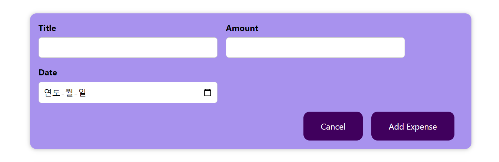
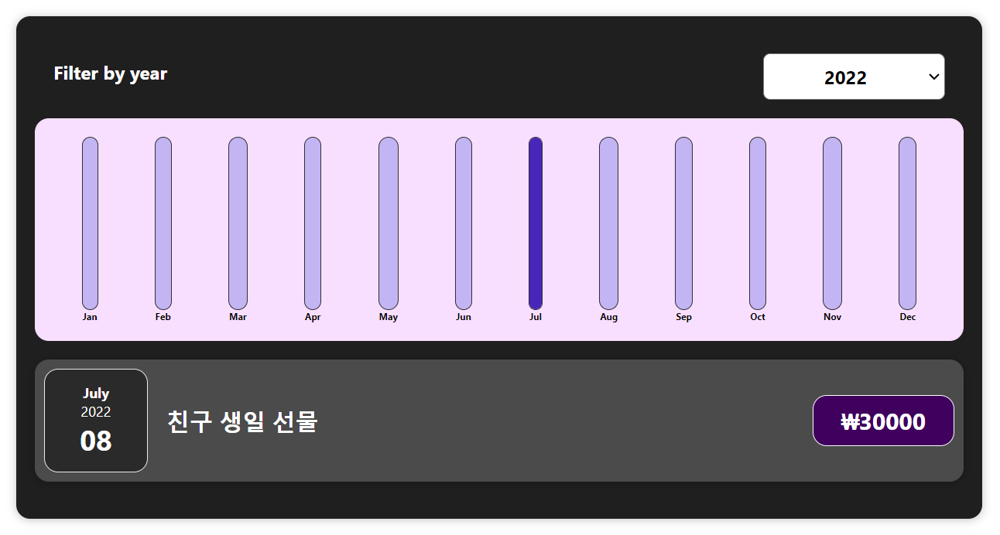
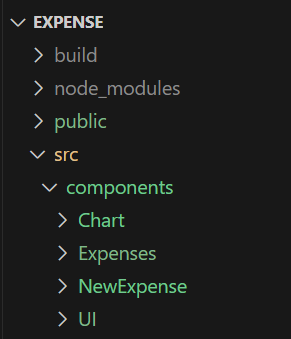

# Expense Manager 🛒
by.udemy React 완벽 가이드
#### [기간]
2023.12.04 ~ 2023.12.20

## [기능 구현] 

#### 1️⃣ 비용 추가하기
  
  
 

#### 2️⃣ 연도 선택하기

 
  
## [느낀 점]
- 한 번에 코드를 짤 생각하지 말고, 체계적으로 짜야한다는 것을 느낌 (설계의 중요성)

- 코드 폴더 정리 잘하기
   
  -> 어떤 스타일이 어떤 컴포넌트에 적용되는지 구분하기 쉽고, 스타일 수정하는 것이 훨씬 쉬워짐
   
  -> 가독성도 좋아지고, 오류 찾기가 수월해짐
   
    
  
